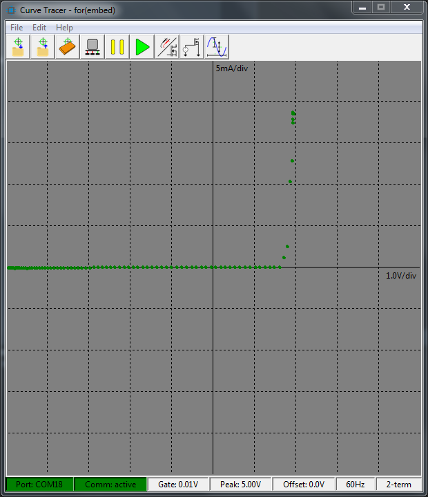

# Project Repositories

Be sure to check out the [firmware](https://github.com/slightlynybbled/curve_tracer_firmware) and 
[hardware](https://github.com/slightlynybbled/curve_tracer_hardware) repositories!

# Installation

In a Python 3 environment, one might simply `pip install curve_tracer` or `pip3 install curve_tracer`.

In Windows, there is a single-file executable in the [releases](https://github.com/slightlynybbled/curve_tracer_gui/releases)
directory.  Still working on the single-file executable for linux environments.  Thanks to [PyInstaller](http://www.pyinstaller.org/)!

# Running

If installed using `pip`, then simply type `curve_tracer` with your Python environment active.  If you 
are using the executable, then you should be able to simply double-click on the executable.

# Linux Considerations

On linux distributions, you may need to install additional dependencies.  For
instance, on the Rasberry Pi (Debian-based):

    apt install python3-dev python3-setuptools python-imaging
    apt install libjpeg-dev libtiff4-dev zlib1g-dev libfreetype6-dev libwebp-dev
    apt install tcl-dev tk-dev
    
I realize that all of this can be installed in one run.  Go for it.

